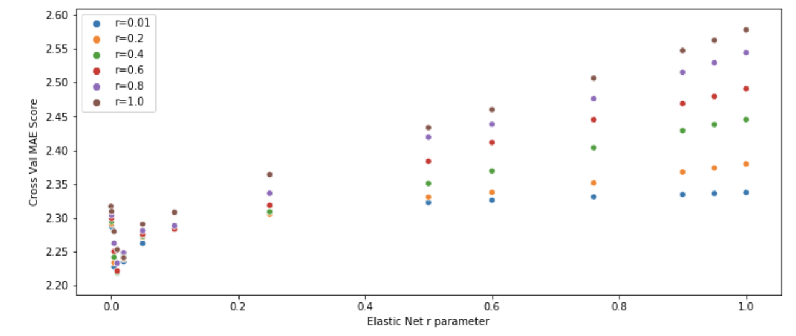

# NYC Playgrounds

For the full notebook:

https://github.com/kylejcaron/nyc_playgrounds/blob/master/notebooks/Modeling.ipynb

If you're having trouble loading the notebook, here's an html rendering (note, LaTeX isn't supported): 

http://htmlpreview.github.io/?https://github.com/kylejcaron/nyc_playgrounds/blob/master/modeling.html

# Summary

The goal of this project is to identify areas in NYC with low playground availability and offer recommendations for intervention. 

By looking at a good model's predicted number of playgrounds and comparing it to the actual number of playgrounds per zip code, we can easily identify underserved areas of NYC. For instance if a *good* model predicts that some zipcode should have 10 playgrounds, but it only has 2 playgrounds in real life, that zip code is probably in need of some playgrounds. This is all dependent on having a good model, of course.

I want to clear up some definitions before you go through this. 

__Playground vs. Park__: To be clear, playgrounds and parks are separate entities. A Playground is a Park, but a Park is not necessarily a playground. The Parks dataset is useful to provide a zipcode for the Playgrounds, however parks will not be considered playgrounds unless they are also present in the Playgrounds dataset. A playground is typically a large open space to play on, usually for children, while a park is an area of land set aside for environment preservation and/or informal recreation ([unofficial source](https://wikidiff.com/park/playground)).

## Cleaning the Data

This project used the following datasets:
  * [SOI Tax Return Data for NYC](https://www.irs.gov/pub/irs-soi/16zpdoc.doc)
  * NYC Parks Dataset (Joined to Tax Return data by Zip Code)
  * NYC Playgrounds Dataset (Joined to NYC Parks Dataset by Property ID)
  
NYCs open data is notoriously messy. In this case, many of the Addresses for NYC Parks were missing Zip Codes, however plenty had street addresses. I used GeoPy, a free (free-ish) Geocoding library to search for missing Zip Codes through their street addresses; while it wasn't perfect, it got the job done. 

These Parks were merged with the Playgrounds dataset through Property IDs, so each Playground was associated with a Zip Code. Then, the Parks/Playgrounds dataset was aggregated so that the dataset was now the number of Playgrounds in each Zip Code.

Finally, after combining all three datasets by Zip Code, I dropped all features from the Parks/Playgrounds datasets (apart from the target variable, __Number of Playgrounds__) to avoid __data leakage__.

## Feature Selection

The Tax Return dataset presented an interesting challenge in that there were roughly 200 different features, and a lot of multicollinearity. 

For most variables, there were two associated features, for example, `Total Income Amount` (The _Amount_ variable, specified with an `A`) and `Number of Returns with Total Income` (the _Number of Returns_ variable, specified with an `N`). These feature pairs are obviously collinear, so I chose to do a logical dimensionality reduction: Normalizing the `Amount` by the `Number of Returns` for each item. This turned the feature pair into __Average Amount per Eligible return__. 

*To be clear, I decided to fit a model with and without this dimensionality reduction and achieved similar results, however they were moderately better  with this dimensionality reduction.*

After this dimensionality reduction, I was still left with 100 features. A heatmap is shown below:

There's clearly still a lot of multicollinearity. Even if I was to try and fit a Multiple Linear Regression model (which is quite the stretch with a wide and short dataset like this), the multicollinearity would mask the true relationship between each predictor and the target variable. For this reason I tried out two methods of Feature Selection, __Recursive Feature Elimination__, and __L1 Regularization__ (__Lasso Regression__ and __Elastic Net Regression__ models). The Elastic Net model proved not only to have good predictive capabilities, but more importantly, it reduced the number of independent variables in my dataset from about 100 features down to 20. The heatmap of these 20 features also has a lot less multicollinearity as well. 

## Model Fitting

Several different models were evaluated:
 - Recursive Feature Elimination with Linear Regression
 - Ridge Regression
 - Lasso Regression
 - Elastic Net Regression
 - Random Forest Regression
 - Gradient Boosting Regression
 
Models were evaluated with 10-fold Cross Validation, and then finally validated on a held out test set. The error metric of choice was Mean Absolute Error (__MAE__) since it is easily interpretable and since the magnitude of the target variable was so low, and the distribution was relatively narrow, I wasn't too concerned by outliers either. I decided to look at  as well, since a non-technical audience would be more familiar with it than MAE.

In this preliminary model fitting stage, I found that Gradient Boosting Regression, Random Forest Regression, and Elastic Net Regression performed the best. Despite really strong predictive power from the Ensemble Learning methods, I favored Elastic Net Regression because it is slightly more interpretable. 

The __residual plot__ from the initial Elastic Net model is below. 

One thing to note is that there's a lot of heteroscedasticity in the residuals plot above. __Even more interestingly, there's a significantly negative residual that has far less playgrounds than what the Model predicts.__ That is exactly what I was hoping to identify with this investigation. This zip code is expected to have far more playgrounds than what it actually has in real life; it's an underserved community. 

Before exploring that further, I went through all 20 features and performed feature transforms (such as Square Root and Log Transforms) to reduce the heteroscedasticity of the model. While there was still some slight heteroscedasticity, it was certainly improved. 

## Final Model

### Parameter Tuning

After feature transforms, I tuned the `r` parameter of the Elastic Net model via Cross-Validated MAE evaluation over a range of values for `r`. 

The best `r` parameter was found to be `r = 0.01`.

The final Elastic Net model with the transformed features and tuned parameter $r$, resulted in a __10-fold Cross Validated Mean Absolute Error of 2.39__. As a final validation of the model, I tested it on a holdout set which resulted in a __Mean Absolute Error of 2.17__ and an __ of 0.72.__

# Interpretation and Key Findings

There was one key neighborhood that stood out more than any other, and that was __Zip Code 10475__. The fitted model expected it to have 7 playgrounds but it had __zero__. Upon further inspection (a google search), the zip code actually has 1 playground, but to reiterate, the model expects there to be 7 playgrounds. 1 Playground is hardly enough, and this would be a great area for intervention.

There were 19 features found to have significant predictive power on playground availability, however I'd like to focus on just one that I found to be particularly interesting, __Earned Income Credit (EIC)__. __EIC__ is a refundable tax credit typically given to low income families that have children, so it makes sense that there would be playgrounds nearby. Below is a picture of the relationship, color-coded by borough.

As the __Average Earned Income Credit per Eligible Return__ increases by 1, the number of playgrounds increases by 4.17.

## Further Opportunities

There's a lot of opportunity to explore this data further. I'd be particularly interested in also looking at Playground Quality, as well as Playground Availability in units of hours, since many playgrounds in low income areas double as school zones and therefore are not available during school hours as shown below.

